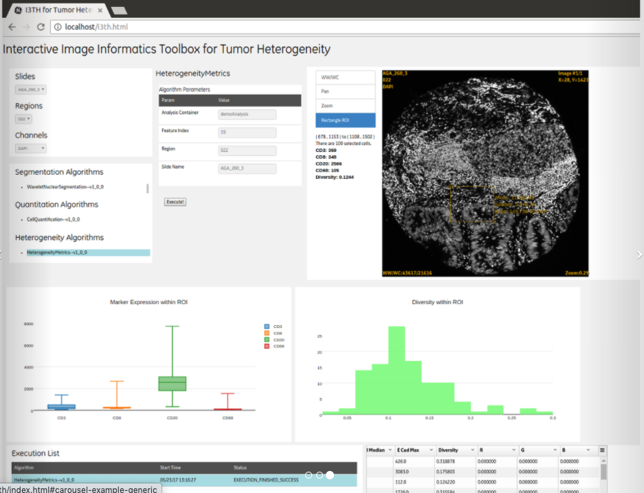
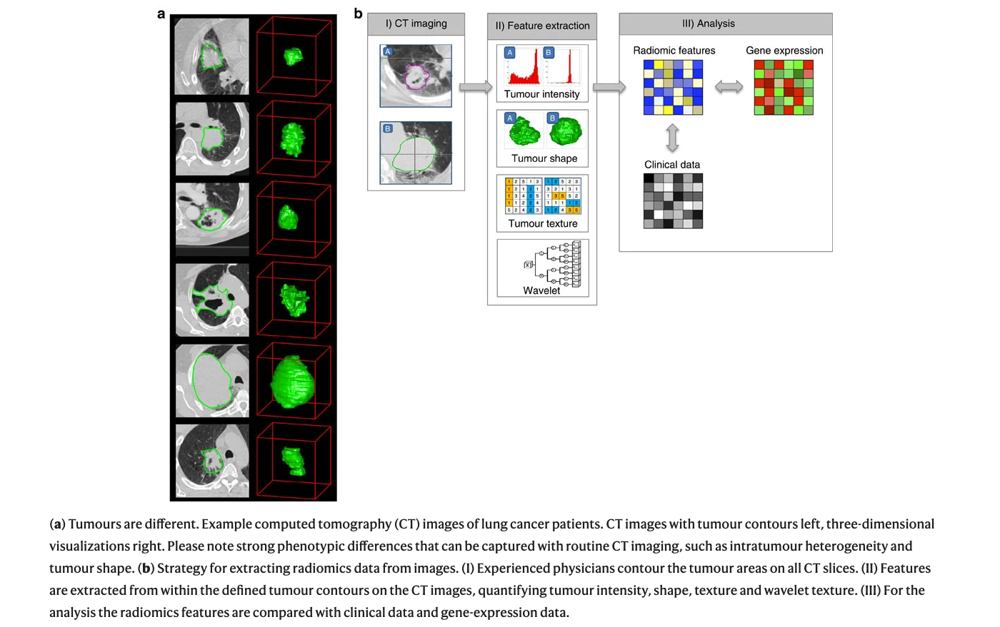

# Informatics tools for Cancer Research

Biomedical research at large, and in particular cancer research, now involves massive amounts of data of a variety of types collected through rapidly advancing technologies. To allow current and future cancer researchers to fully take advantage of the opportunities afforded by these technologies, our mission is to make informatics tools as accessible as possible to all cancer researchers.  From omics, to imaging, to clinical data, cancer researchers can now examine biospecimens, animal models, and clinical data with unprecedented depth and breadth.

This course aims to provide an overview of tools available to cancer researchers to afford them more flexibility in their research. It will also provide guidance for best practices for performing informatics research.

For a brief introduction about different imaging methods see [here](https://www.independentimaging.com/abcs-imaging-difference-xray-ultrasound-mri-ct-scan/) and [here](https://www.radiologyinfo.org/en/info.cfm?pg=pet).

## ITCR Tools
On the [ITCR website](https://itcr.cancer.gov/informatics-tools), you will find a list of tools developed by researchers funded by ITCR. 

There are 5 general categories of tools.

1) Imaging Tools

From tools to segment PET-CT scans, to algorithms for assessing tumor heterogeneity based on immunofluorescence images, to repositories of radiology and pathology images, the ITCR Imaging tools offer a variety of support for image processing and image analysis needs. 

Slides: 
1) PIIP - viewing, annotating, and analysis of whole slide images
2) QUIP - analysis, management, and exploration of whole slide tissue images (backend is FeatureDB)
3) HistoQC - examining slides for artifacts and computing slide characteristics (stain intensity etc) for quality control and data standardization
4) [Thrive](https://www.csb.pitt.edu/ith/) - interactive GUI based tool for evaluating tumor heterogeneity/diversity, cell segmentation, and cell quantification using different algorithms

[[Source](https://www.csb.pitt.edu/ith/)]

[[Source](https://www.csb.pitt.edu/ith/)]

PET images:
5) PETCT-CoSeg - segmentation of PET-CT scans
6) Tools for Quantitative Analysis of PET Imaging - 3D slicer extensions - normalization, segmentation, and extraction of quantitative indices

7) dcmqi (DICOM - digital imaging and communications in medicine (dcm) for Quantitative Imaging (qi)) - libraries and command line tools for standardizing communication of quantitative image analysis using the DICOM standard. This is required for sharing data in some archives like TCIA.

See [this article](https://doi.org/10.7717/peerj.2057) and [this article](https://doi.org/10.1177/0962280214537333) for more information. 
- [voxel-based segmentation](http://dicom.nema.org/medical/dicom/current/output/chtml/part03/sect_A.51.html)
- [parametric maps](http://dicom.nema.org/medical/dicom/current/output/chtml/part03/sect_A.75.html) to "[specify] a multi-frame image representing pixels with real world values."
- image-based measurements with structured [reporting template TID1500](http://dicom.nema.org/medical/dicom/current/output/chtml/part16/chapter_A.html#sect_TID_1500)
 - conversion of diacom data to JSON and NIFTI
 
8) 3Dslicer 
 - 3D visualization (volume rendering), and image processing - registration and interactive segmentation 
 - support for MRI, CT, US (ultra sound), nuclear medicine (PET), and microscopy
 
 
[[Source](https://www.slicer.org/wiki/Documentation/4.8/Training#/media/File:Slicer4minute-image.png)]

MRI images:
9) diffusion MRI neruosurgical planing (using 3D slicer)
10) maybe lesion tracker...?
11) [SlicerDMRI](http://dmri.slicer.org/) -perform additional MRI analyses beyond that of 3Dslicer including command line batch processing, computing scalar maps, and registering multimodal data.

Archives/Repositories:
12) TCIA - radiology and pathology images with annotations and clinical information and in some cases paired omics data
tools here too?
13) CDSA - pathology data from the Cancer Genome Atlas

Specialized tools:
14) Breast Radiodensity assessment
15) TOPAS - ionizing radiation imaging and therapy simulations
16) [Ivy Glioblastoma Atlas Project (Ivy GAP)](https://glioblastoma.alleninstitute.org/ish/) data and tools - Glioblastoma patient data including(MRI/CT scan data, as well as gene expression and anatomic characterization (ex. infiltrating vs cellular) of Glioblastoma tumor in situ hybridization (ISH) tissue sections and adjacent hematoxylin and eosin (H&E)-stained sections. See [the Ivy GAP database ](http://ivygap.org/) and [ivygapSE](https://github.com/vjcitn/ivygapSE) a tool that provides support for Summarized Experiment data - compatible for analysis in R for the tumor anitomical and gene expression data. See also [ivyGlimpse](https://itcr.cancer.gov/informatics-tools/ivyglimpse) to explore tumor image data and how it relates to survival and gene expression. See [this article](https://www.ncbi.nlm.nih.gov/pmc/articles/PMC6414061/) and [this article](https://aapm.onlinelibrary.wiley.com/doi/abs/10.1002/mp.14556) for more information.

> "...an anatomically-based transcriptional atlas of human glioblastoma that aligns individual histologic features with genomic and gene expression patterns, thus assigning a molecular significance to the most important morphologic hallmarks of glioblastoma."

>To create the atlas, we surveyed the anatomic features by in situ hybridization (ISH), analyzed their transcriptomes by laser microdissection (LMD) and RNA sequencing (RNA-Seq), and validated the feature specific, gene expression enrichment of newly-identified markers by ISH (Fig. 1). We created a clinical and genomic database (http://ivygap.org/) for the 41-patient cohort (table S1) whose tumors (n=42) were evaluated to create the atlas. We describe gene sets whose expression is enriched in the anatomic features, measurements of intra- and inter-tumor heterogeneity, and a molecular subtype classification of transcriptomic samples from our atlas and The Cancer Genome Atlas (TCGA). Together, these two on line resources constitute the Ivy Glioblastoma Atlas Project (Ivy GAP).

Data transfer/sharing/management:
17) Globus is similar to Xsede seems like... as is codalab

Imaging analysis platforms:
18) cbibop - no updates since 2015??? think we should just show [codaLab Project](https://codalab.org/) - open-source web-based platform that enables researchers, developers, and data scientists to collaborate, with the goal of advancing research fields where machine learning and advanced computation is used. https://youtu.be/WwFGfgf3-5s 
experiment management system and easy collaboration system  - includes competitions such as Liver tumor segmentation challenge

19) [XNAT](https://www.xnat.org/about/) - PET/CT (maybe MRI, MEG and EEG - look at connectomeDB???) data analysis
- upload DICOM data , organize and share data, view, query, and download data, perform analysis through a secure API with access to high-powered computing clusters

20) Cancer Imaging Phenomics Toolkit (CaPTk) - GUI or command line. web portal with tools for imaging and phenomics analysis for clinical decisions - currently focused on brain, breast, and lung cancer. In addition to image analysis tools for registration, segmentation, and feature extraction, it also aid daignostics with prognostic modeling, risk etimation and radiogenomics. See [this article](https://www.ncbi.nlm.nih.gov/pmc/articles/PMC7402244/) for more information. Designed for research purposes only and has not been reviewed or approved by the Food and Drug Administration or by any other agency. It is not intended or recommended for clinical applications.
https://youtu.be/WrjoJOxq4i8

[[Source](https://cbica.github.io/CaPTk/index.html)]

21) RADIOMICS.io - radiographic phenotyping tool using automated algorithms - allows for users to engineer features or to perform data driven analyses. See [here](https://www.radiomics.io/science.html) for publications about using automated phenotyping using imaging. 

[[Source](https://www.nature.com/articles/ncomms5006)]

22) Region Templates...
23) [DCMTK](https://support.dcmtk.org/redmine/projects/dcmtk) - A set of command line tools for working with DICOM data, including examining and converting DICOM image files and data transfer and storage of images

### Galaxy

This section was written by Jeremy Goecks:

Galaxy is a web-based computational workbench that connects analysis tools, biomedical datasets, computing resources, a graphical user interface, and a programmatic API (Figure 1). Galaxy (https://galaxyproject.org/) enables accessible, reproducible, and collaborative biomedical data science by anyone regardless of their informatics expertise. There are more than 8,000 analysis tools and 200 visualizations integrated into Galaxy that can be used to process a wide variety of biomedical datasets. This includes tools for analyzing genomic, transcriptomic (RNA-seq), proteomic, metabolomic, microbiome, and imaging datasets, tool suites for single-cell omics and machine learning, and thousands of more tools. Galaxy’s graphical user interface can be used with only a web browser, and there is a programmatic API for performing scripted and automated analyses with Galaxy.

Galaxy is used daily by thousands of scientists across the world. A vibrant Galaxy community has deployed hundreds of Galaxy servers across the world, including more than 150 public and three large national/international servers in the United States, Europe, and Australia (https://usegalaxy.org, https://usegalaxy.eu, https://usegalaxy.org.au). The three national/international servers (Figure 2) have more than 250,000 registered users who execute >500,000 analysis jobs each month. Galaxy has been cited more than 10,000 times with >20% from papers related to cancer. The Galaxy Tool Shed (https://usegalaxy.org/toolshed) provides a central location where developers can upload tools and visualizations and users can search and install tools and visualizations into any Galaxy server. Galaxy has a large presence in the cancer research community. Galaxy serves as an integration and/or analysis platform for 7 projects in the NCI ITCR program. There is also increasing use of Galaxy in key NIH initiatives such as the NCI Cancer Moonshot Human Tumor Atlas Network (HTAN) and the NHGRI Data Commons, called the AnVIL (https://anvilproject.org/).

Galaxy’s user interface, accessible via a web browser, provides access to all Galaxy functionality. The main Galaxy interface (Figure 3) has three panels: available tools (left), running analyses and viewing data (middle), and a full history of tools run and datasets generated (right). Datasets for analysis in Galaxy can be uploaded from a laptop or desktop computer or obtained from public data repositories connected to Galaxy. With Galaxy, complex workflows composed of tens or even hundreds of analysis tools can be created and run. In Galaxy’s workflow interface (Figure 4), tools can be added and connected via a simple drag-and-drop approach. Galaxy users can share all their work—analysis histories, workflows, and visualizations—via simple URLs that are available to specific colleagues or a link that anyone can access. Galaxy’s user interface is highly scalable. Tens, hundreds, or even thousands of datasets can be grouped into collections and run in parallel using individual tools or multi-tool workflows. In summary, Galaxy is a popular computational workbench with tools and features for a wide variety of data analyses, and it has broad usage in cancer data analysis.

