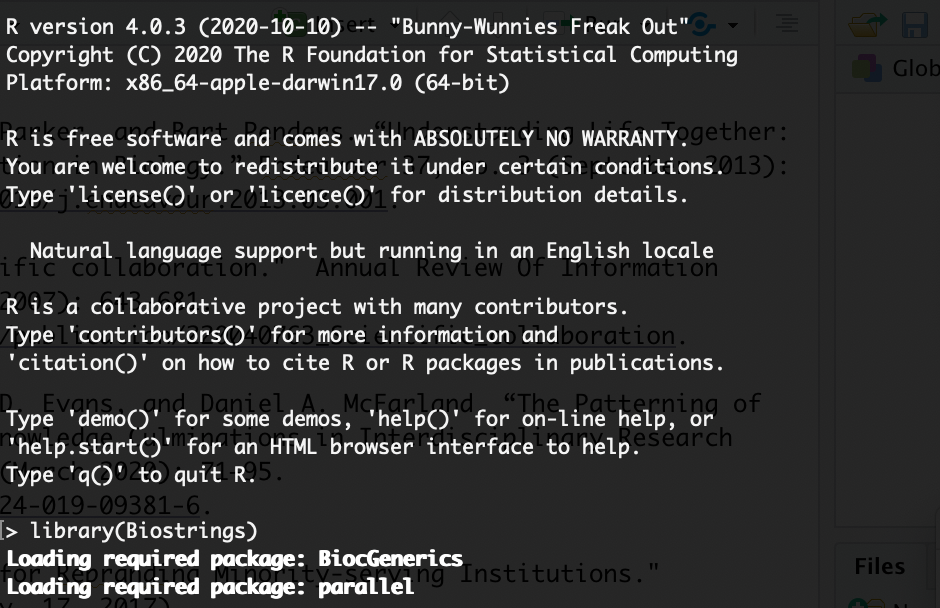
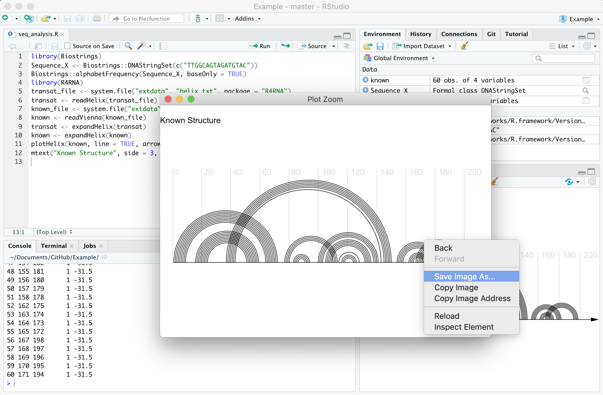

# Computing for Cancer Research

The main objectives of this tutorial are to:
1) Help you evaluate different computing platforms  
2) Discuss the state of “Cloud” computing  
3) Describe the key parts of a computer  

## Local and Cloud Computing

Finding the **"right"** computing platform depends on many different considerations.  

Important questions to ask are:  

1) Do I need an [graphical interface](https://www.omnisci.com/technical-glossary/graphical-user-interface), a [command line interface](https://searchwindowsserver.techtarget.com/definition/command-line-interface-CLI), or both?

What do we mean by this?

A [graphical interface](https://www.omnisci.com/technical-glossary/graphical-user-interface) or graphical user interface or GUI, allows for users to choose functions to perform by interacting with visual representations. They have a "user-centered" design that creates a visual environment where users can for example click on tabs, boxes, or icons for to perform functions.

Galaxy offers a graphical interface for performing analyses:

A [command line interface](https://searchwindowsserver.techtarget.com/definition/command-line-interface-CLI) also known as a character interface allows for software functions to be performed by specifiying through commands written in text. This typically offers more granular control than a Graphical interface, but is often less user friendly.

For example, one could perform functions in R using Bioconductor packages such as [Biostrings](https://bioconductor.org/packages/release/bioc/html/Biostrings.html) with a command line interface:

A situation where you might use both a command line interface and a graphic interface, is using RStudio to perform  an analysis in R with Bioconductor packages.

As you can see you can click and save a plot with the graphic interface. 

2) Am I working with protected data that requires special security precautions?

For example, are you working with electronic health records that require HIPAA compliance.

[[source](https://www.paubox.com/blog/what-is-hipaa/)]

3) How computationally intensive are my tasks? 

4) How much storage space do I need for both temporary and long term data?

Choosing a computing platform involves both software and hardware decisions.  With regards to hardware, two common options include:  

1) **Personal computers** - whether it be a laptop, a desktop, or a [server](https://techterms.com/definition/server)   
2) **Shared computers** - whether it be an institutional [HPC cluster](https://www.hpc.iastate.edu/guides/introduction-to-hpc-clusters/what-is-an-hpc-cluster)(which stands for High Performance Computing) or a national resource like [Xsede](https://www.xsede.org/)  

More recently, commercial Cloud solutions are becoming a more viable solution, offered by companies like Amazon, Google, and Microsoft.  Choosing a platform remains a sizable commitment with regards to the time required for training and setup.  So how do you know whether the Cloud is right for you?

While no single factor is usually sufficient to make this decision, important considerations include:

Are my local resources sufficient?  When a local solution already works, one may rightly question the time required to migrate to the Cloud.  However, when local solutions are insufficient or unsustainable, then the Cloud becomes a competitive option.

Am I working with especially big or controlled access datasets?  Increasingly large datasets like the NCBI Sequence Read Archive are being stored on the Cloud.  If your work relies on being able to access the entire dataset, then the Cloud may be your only practical option.  Furthermore, if you work with controlled access data, then more platforms are providing compliance with regulations like hippa and FedRAMP.

Do I need to work with collaborators?  Computational research increasingly involves larger and larger collaborations.  While many fragmented systems exist to share work, the Cloud presents an opportunity for everyone to share the exact same computational environment covering hardware, software, and datasets.

If Cloud Computing makes sense for you, then you’re in luck!  The past decade has seen the development of many efforts to make Cloud computing, easier, faster, and more affordable.  As each platform has their strengths and weaknesses, we will now discuss several opportunities and challenges that Cloud computing presents in the field of computational genomics.

### State of Cloud Computing

The state of Cloud computing is continually evolving.  Here, we highlight three main current opportunities:

1) **Sharing Workflows**  

The first opportunity is the increasing ease with which one can share and collaborate on research projects. Shown here is the History feature of Galaxy whereby one can share not only datasets but also every computational manipulation that was performed.

By sharing such a History, one can reproduce an analysis in its entirety, allowing collaborators to offer comments and extend upon the work.

 

2) **Sharing Workflows between Platforms**

While sharing complete analysis histories is for the most part constrained to a particular software platform, a second opportunity that has arisen is the ability to share Workflows between platforms.

Shown here is a diagram of a single cell analysis pipeline published by the Klarman Cell Observatory on Dockstore:

This higher level abstraction coupled with container technology allows this multistep analysis to be run with relative ease on supporting platforms like Terra and DNAnexus.

3) **Using Commondity Hardware**

The third opportunity we highlight is the increasing ease by which one can provision commodity hardware at scale.  

What this means is that you can pay reasonable costs to complete your analysis in less time by renting hundreds to tens of thousands of Cloud-based computers -- importantly stopping the bill when your analysis is complete.  Specialized hardware like GPUs and large memory nodes are also available for rent allowing you to pay only for what you need.

Balancing these three opportunities are four challenges:

1) **Data Transfer**  

Data transfer and data management remains a cumbersome task.  While storing data in the Cloud has its advantages, many people are still not willing to be for the corresponding storage costs.  Thus, careful planning is necessary with regards to what data will be stored where, as well as budgeting the time necessary to transfer data back and forth.

2) **Data Security**  

A discussion of data in the Cloud would not be complete without commenting on security compliance.  Most Cloud resources offer features that make it easier to access and share data, and these features often come at the **expense of security**. Thus, special precautions must be implemented to securely store protected datasets such as human genome sequences and electronic health records.

3) **Costs** 

Controlling costs, especially with regards to storage, presents a third formidable challenge.  As many Cloud providers naturally want to encourage usage of their platforms, users must be aware of how much money is currently being spent and be able to project how much money is likely to be spent in the future.  We will briefly overview cost controls in the next section.

While software platforms can help mitigate these challenges, Cloud computing still incurs costs from the underlying hardware providers. 

4) **IT**  

A final challenge is that many IT support staff do not have extensive experience managing Cloud resources.  Should IT choose to support analysis on the Cloud, they would face the aforementioned challenges of understanding and supporting data management, security compliance, and cost management.  Fortunately, large initiatives like AnVIL, Galaxy, and CyVerse continue to work on democratizing access to Cloud computing by tackling many of these challenges.  

## Local Costs

## Cloud Costs
